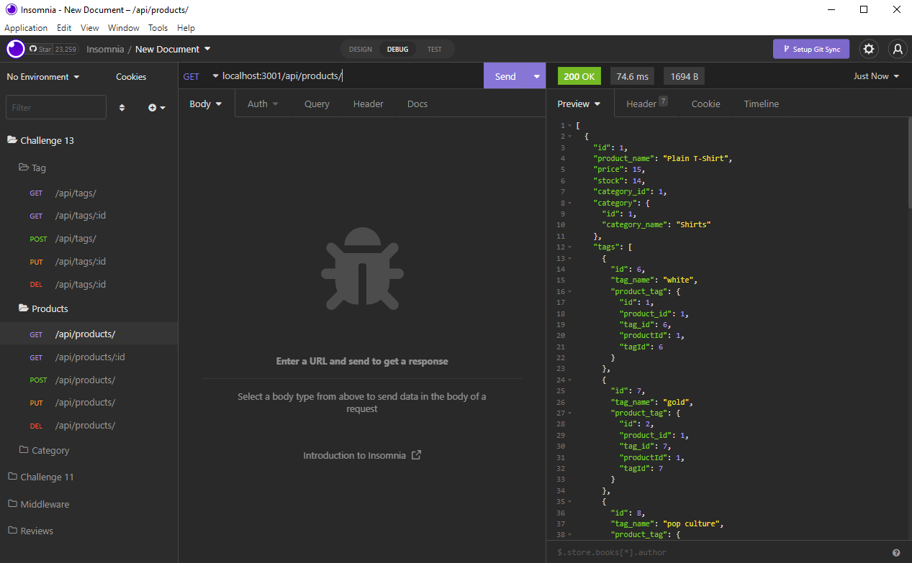

  ## myEcommerceBackEnd
  ___
  ## Table on Contents

  1. [License](#License)
  2. [Description](#Description)
  3. [Installation](#Installation)
  4. [Usage](#Usage)
  5. [Contributing](#Contributing)
  6. [Tests](#Tests)
  7. [Questions](#Questions)
  ___
  ## License
  
  ___
  ## Description
  This application uses node.js, express.js, mysql, Sequelize ORM and the dotevn package to create the backend of an E-commerce website. Express was used to create api routes and mysql was used to store a product database. With mysql we are able to use reference are relationships to query specify information about each product from 3 databases. Insomnia was also used to test and build crud endpoint such as get, put, post, and delete. 
  ___
  ## Installation
  To install the project clone the repository and run npm i.
  ___
  ## Usage
  This application is only the backend of the E-commerce website. The JSON response can be view with accessing the API endpoint with http://localhost:3001. The routes can be found int the routes directory.

  Link to usage example here: [VIDEO](https://drive.google.com/file/d/1OaC64IegIR7ZZy_693Ew5fp5s4s64zpf/view)
  ___
  ## Contributing
  Anyone is welcome to contribute and clone this repository. 
  ___
  ## Tests
  To test this applications, use insomnia or postman and run the api endpoints.
  ___
  ## Questions
  For more information and questions please email me @ matthew.yang@hunterdouglas.com 

  [GitHub: myang53tr](https://github.com/myang5t3r)
  ___
  